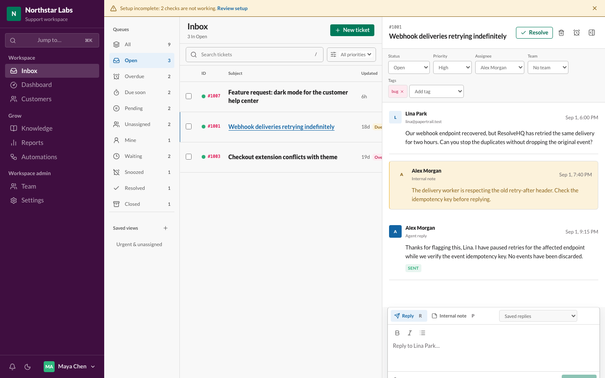
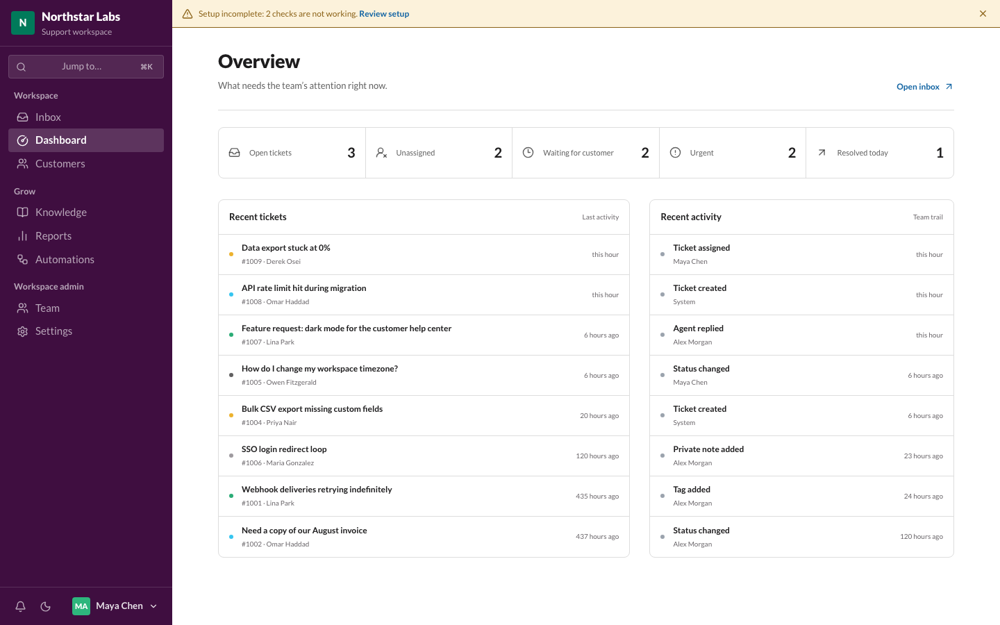
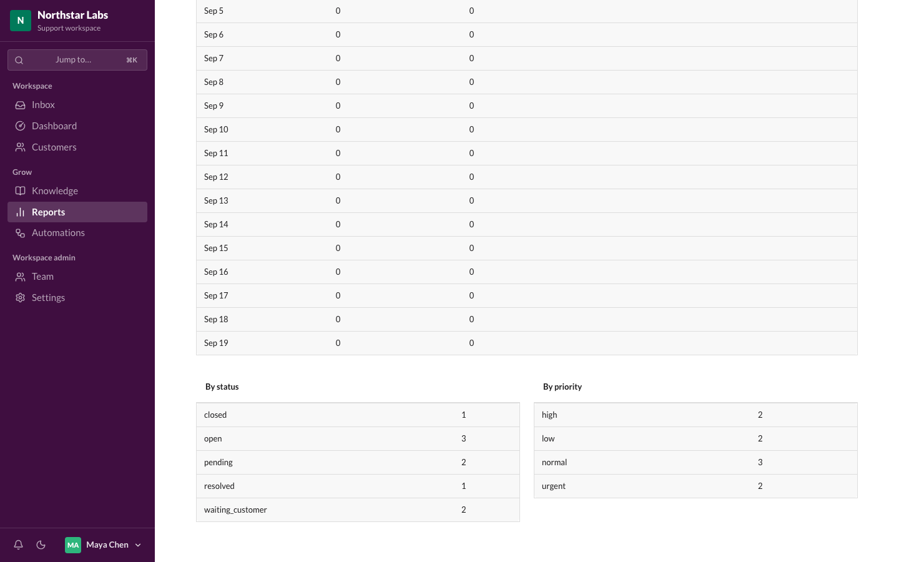
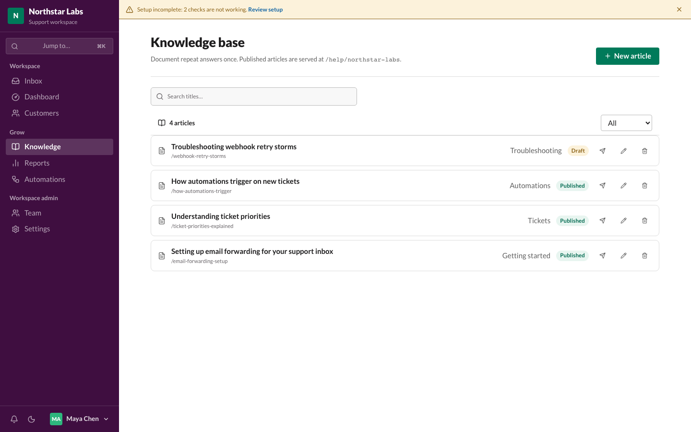
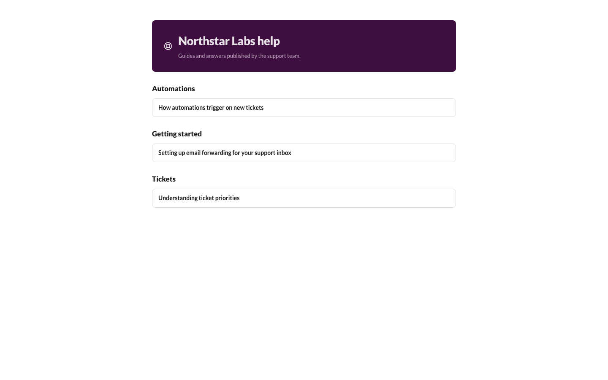
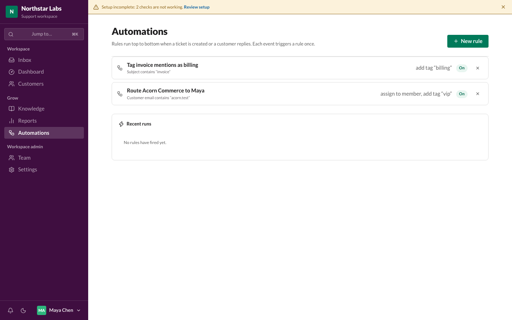
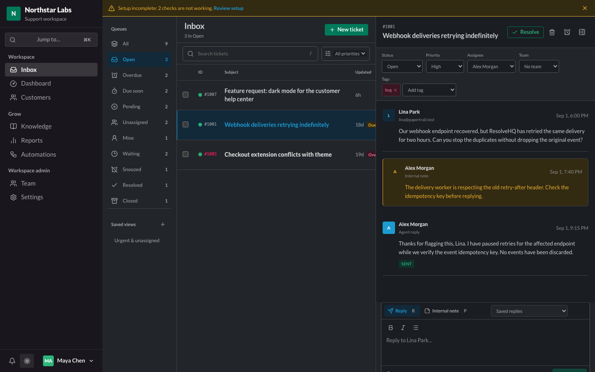

# ResolveHQ

[](https://github.com/mirza-rizvi/ResolveHQ/actions/workflows/ci.yml) [](https://github.com/mirza-rizvi/ResolveHQ/releases) [](LICENSE) [](https://developers.cloudflare.com/workers/)

ResolveHQ is a Cloudflare-native, self-hostable helpdesk for small support teams.

Requirements: a Cloudflare account and a domain on Cloudflare (for Email Routing). Runs on the Free plan for small teams.

[](https://deploy.workers.cloudflare.com/?url=https://github.com/mirza-rizvi/ResolveHQ)

## Screenshots

The three-pane inbox, showing a ticket thread with an internal note and a queued reply:



| | |
|---|---|
|  Overview dashboard |  Reports |
|  Knowledge base |  Public help center |
|  Automations |  Dark mode |

More screenshots, including the mobile view and the customer and settings pages, are in [`docs/images/`](docs/images/).

## What you can do

- Run a shared inbox with tenant-isolated customers, tickets, assignment, status, priority, tags, and full-text search.
- Sign up as owner, invite teammates, and manage Owner/Admin/Agent roles with a workspace switcher across organizations.
- Thread email correctly per RFC 5322, resistant to subject-line spoofing across tickets.
- Receive mail through Cloudflare Email Routing and send it through Resend, with delivery status, retries, and idempotent webhooks. Outbound replies carry their linked attachments, and dead-letter queues drain to durable, recoverable records.
- Attach files to tickets through validated, authorized R2 uploads.
- Reply faster with saved replies, internal notes, AI-drafted responses (opt-in), and a responsive three-pane inbox with optimistic-version conflict handling.
- Reset passwords and accept invitations through system email sent via the same provider seam as ticket mail.
- Publish a public help center from knowledge-base articles, with drafts kept private to your team.
- React to what happens: send a signed webhook to your own service, a message to a Slack channel, or a note to a Telegram chat when a ticket is opened, assigned, changes status, misses its response target, gets a customer reply, or is rated. Payloads carry ids and statuses, never message text.
- Point an AI assistant at your helpdesk. Claude Code, Claude Desktop and Cursor can connect over MCP and search tickets, read a thread, check queue counts, look up a customer, and search your knowledge base. Read-only on purpose: there is no tool that can reply, assign, or change anything.
- Drive ResolveHQ from a script. Admins create scoped API keys that work against `/api/v1`, optionally expiring and optionally limited to particular inboxes. A key is shown once and can never do more than the person who created it — demote them and the key loses the same powers immediately.
- Ask customers how it went. When a reply resolves a ticket, three rating links are added to the bottom of the email; one click records the answer and an optional comment follows. Self-hosted, with no third-party survey service and no tracking pixel, and scores always appear with the number of answers behind them.
- Snooze a ticket until a date and time, with a reason. It leaves the working queues, never counts as overdue while it sleeps, and comes back early the moment the customer replies — so deferring something is honest rather than a bet that you will remember it.
- Set response targets that respect your working hours: name a first-reply and resolution target per priority, define a weekly schedule and holidays in your own timezone, and get Overdue and Due-soon queues plus a badge on each ticket. Nothing is tracked until you create a policy, and a ticket arriving on Friday evening is not late on Saturday morning.
- Track volume and response speed in Reports, export any window to CSV, and automate triage with rule-based Automations.
- Notify agents of assignments and customer replies in-app, and work comfortably in light or dark mode.
- Export everything stored about a customer as JSON, or erase it with a durable, resumable workflow that cancels queued mail.
- Take your whole workspace with you. One click exports every table as newline-delimited JSON into your own R2 bucket, a slice at a time so a large workspace finishes without timing out, with per-table downloads and an optional weekly schedule. Passwords, key hashes and webhook secrets are never included.
- Recover automatically: a five-minute cron job retries stalled mail jobs and cleans up staging and orphaned data.
- Check whether your deployment actually works: a setup page verifies configuration and looks up the MX, SPF, DKIM, and DMARC records for your inbox domains, telling you what to change when something is missing.
- Control AI assistance per workspace: it stays off until an admin enables it in Settings, and only then are ticket conversations sent to the configured provider.
- Set `TICKET_RETENTION_DAYS` (for example `365`) to have the scheduled sweep permanently delete resolved and closed tickets older than that window, including attachments.

## Interface

The workspace uses a Slack-inspired aubergine sidebar, self-hosted Lato typography, Lucide icons, and Radix UI primitives. Theme-aware controls and status colors support light and dark workspaces. On mobile, bottom navigation and a keyboard-accessible workspace drawer keep all destinations available; ticket columns adapt to preserve subject readability.

Use **Cmd/Ctrl+K** to jump between pages. The sidebar dock contains notifications, theme switching, and account actions.

## How it works

ResolveHQ runs as a single Cloudflare Worker in your own account. Hono serves both the REST API and the built React application. Cloudflare D1 holds tickets and customers, Cloudflare R2 holds attachments, and Cloudflare Queues carry inbound and outbound mail jobs. Cloudflare Email Routing delivers incoming mail to the Worker, and Resend sends outgoing mail. Tickets and attachments are stored in your Cloudflare account; outbound email content passes through Resend. On Workers Paid you can send natively through Cloudflare Email Sending instead, and no mail content leaves your account.

## How much does it cost?

ResolveHQ can run on Cloudflare's Free plan for small deployments, provided usage stays within the current limits for Workers, D1, R2, Queues, Cron Triggers, and Email Routing. **Sign-in is the heaviest CPU path**: Workers Free allows 10 ms of CPU per request, and password hashing is the one operation that comes close to it, with MIME parsing next. Measure your own deployment before putting it in front of users, and move to Workers Paid if sign-in runs over. Queues are available on Workers Free. R2 requires account activation and billing setup separately. Resend handles outbound email under its own limits. See the [Free-plan audit](docs/cloudflare-free.md).

## Deploy

The easiest way to get started is with the **Deploy to Cloudflare** button above. You will need:

- A Cloudflare account; Workers Free supports Queues. Activate R2 separately.
- A domain on Cloudflare, so you can set up Email Routing.
- Optionally, a Resend account with a verified sending domain, to send outgoing mail.

Check the deployment before signing up. `GET /api/ready` answers without a session:

```bash
curl https://<your-worker>/api/ready   # {"ok":true,"database":"ready"}
```

If it reports `"database":"unmigrated"`, apply the migrations once and re-check:

```bash
npx wrangler login          # if this machine is not already authenticated
npm run db:migrate:remote   # wrangler d1 migrations apply DB --remote
```

Setting the Worker's **Deploy command** to `npm run deploy` in the Cloudflare dashboard makes every
later deploy migrate first. See the [deployment guide](docs/deployment.md#if-the-schema-is-missing).

To check a deployment end to end, including the parts that only fail on real Cloudflare
infrastructure:

```bash
npm run smoke -- https://<your-worker>            # read-only checks
npm run smoke -- https://<your-worker> --signup   # also creates one throwaway workspace
```

After that, open your ResolveHQ URL and sign up as the owner, giving an optional support email that becomes your default inbox. In the Cloudflare dashboard, add an Email Routing rule sending that address to the deployed Worker, then send a test email to confirm it arrives in the inbox.

See the [deployment guide](docs/deployment.md) for what the deploy flow provisions, required configuration, first-run setup, and manual deployment.

## Local development

```bash
npm install
cp .dev.vars.local.example .dev.vars
npm run db:migrate:local
npm run db:seed:local
npm run dev
```

`npm run dev` starts a single Vite dev server on `http://localhost:5173`. The
`@cloudflare/vite-plugin` runs `worker.ts` inside the Workers runtime behind it, so the SPA and
`/api` share one origin and there is no proxy and no second port. The React app hot-reloads;
editing Worker code reloads the Worker.

`npm run preview` builds nothing on its own — run `npm run build` first — and then serves the
built output in the Workers runtime on `http://localhost:4173`, which is the closest local match
to production.

Handlers that have no HTTP route of their own are triggered through the runtime's handler URLs:

```bash
# Run the cron handler once (the schedule itself does not fire locally)
curl "http://localhost:5173/cdn-cgi/handler/scheduled?cron=*/5+*+*+*+*"

# Deliver a raw RFC822 message to the email handler
curl -X POST --data-binary @message.eml \
  "http://localhost:5173/cdn-cgi/handler/email?from=sender@example.com&to=support@northstarlabs.test"
```

Queue producers and consumers run locally as well; messages are delivered by the local queue
simulator. Workers AI has no local simulator, so with the `ai` binding uncommented the dev server
needs `wrangler login` or `CLOUDFLARE_API_TOKEN`.

## Documentation

- [Deployment and configuration](docs/deployment.md)
- [Architecture](docs/architecture.md)
- [Security](SECURITY.md)
- [Changelog](CHANGELOG.md)
- [Contributing](CONTRIBUTING.md)

## Optional configuration

- **AI assistance**: summaries, reply drafts, classification, and translation. Two providers: Cloudflare Workers AI (runs in your own account, no key; uncomment the `ai` block in `wrangler.jsonc` to enable it, then optionally set `WORKERS_AI_MODEL`, default `@cf/meta/llama-4-scout-17b-16e-instruct`, or `AI_GATEWAY_ID` to route calls through an AI Gateway; translation uses `@cf/meta/m2m100-1.2b`) or OpenAI (`OPENAI_API_KEY`, optionally `OPENAI_MODEL`, default `gpt-4o-mini`). The binding wins when both are present. Either way each workspace opts in through Settings, and with neither configured the feature stays hidden and no AI calls are made. With the `ai` binding present, the local dev server needs `wrangler login` or `CLOUDFLARE_API_TOKEN` because Workers AI has no local simulator.
- **Native outbound email**: on Workers Paid, uncomment the `send_email` binding in `wrangler.jsonc` to send through Cloudflare Email Sending instead of Resend, and subscribe a queue to its delivery events. Cloudflare assigns the Message-ID and offers no idempotency key, so a send that is never confirmed stops for administrator review rather than being retried. Leave it commented out and Resend remains the provider. See the [deployment guide](docs/deployment.md).
- **Retention**: set `TICKET_RETENTION_DAYS` as a Worker variable to automatically delete resolved and closed tickets (with attachments) after that many days. Unset means nothing is deleted automatically.
- **Turnstile**: set `TURNSTILE_SITE_KEY` as a Worker variable and `TURNSTILE_SECRET_KEY` as a Worker secret to add a Cloudflare Turnstile challenge to sign-in, sign-up, and forgot-password. Leave both unset and the forms behave exactly as before, with no script loaded and no challenge shown.
- **Reply threading token**: set `OUTBOUND_REPLY_TOKEN=enabled` as a Worker variable to send a signed `support+t<ticket>.<sig>@…` Reply-To on outgoing mail, works with either Resend or native Cloudflare Email Sending. This keeps replies threaded even when a mail system strips your identifying headers, but it needs an Email Routing catch-all rule on the sending domain, since a custom `support+…` address is not matched by an exact-match rule. See the [deployment guide](docs/deployment.md#native-cloudflare-email-optional-workers-paid) for the catch-all requirement.

## Not yet implemented

- Multi-language interface and notifications outside the app (email digests).
- Restoring a workspace export from the app. Exports are one-way on purpose — a restore that half-applies is worse than none — so loading one back is a documented `wrangler` runbook in the [deployment guide](docs/deployment.md#workspace-backups).
- Write access for AI assistants over MCP. The server is read-only until there is a screen for approving what an assistant wants to send to a real customer.

## License

See [LICENSE](LICENSE).
